# クラス図・シーケンス図

## 概要

本ドキュメントはYatzCLIの視覚的な設計図を提供します。Mermaid形式で記述されたクラス図、シーケンス図、状態遷移図を含みます。

---

## 1. ドメイン層クラス図

### 1.1 集約とエンティティ

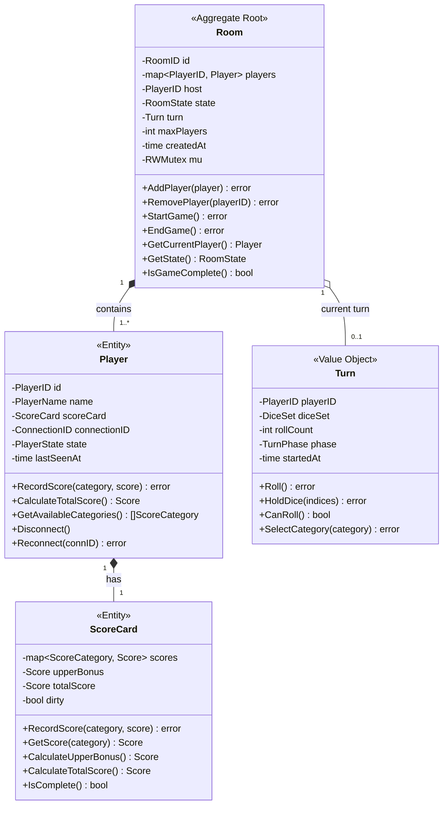

### 1.2 値オブジェクト

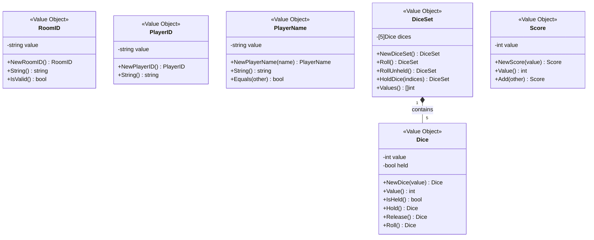

### 1.3 ドメインサービス

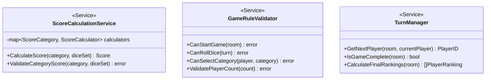

### 1.4 リポジトリインターフェース

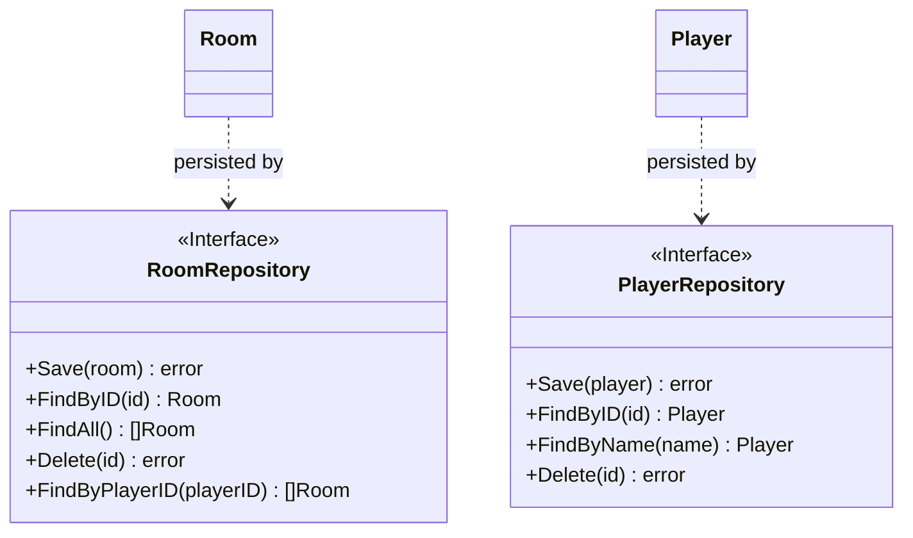

---

## 2. アプリケーション層クラス図

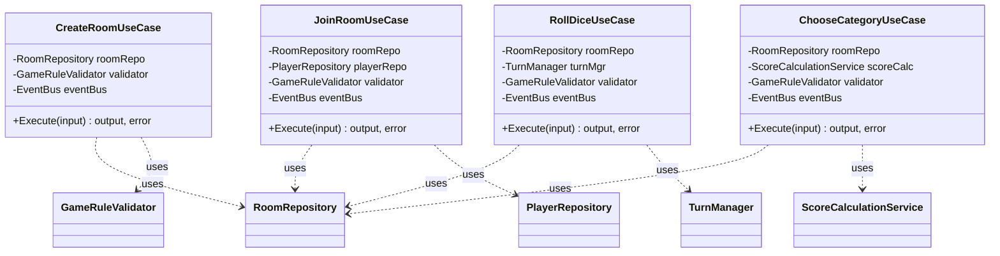

---

## 3. インフラ層クラス図

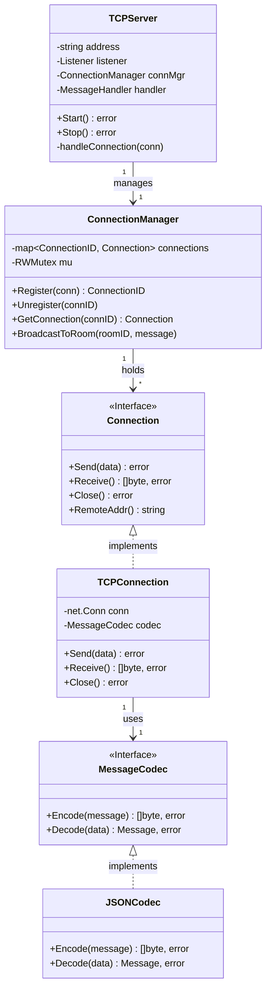

---

## 4. レイヤー間の関係図

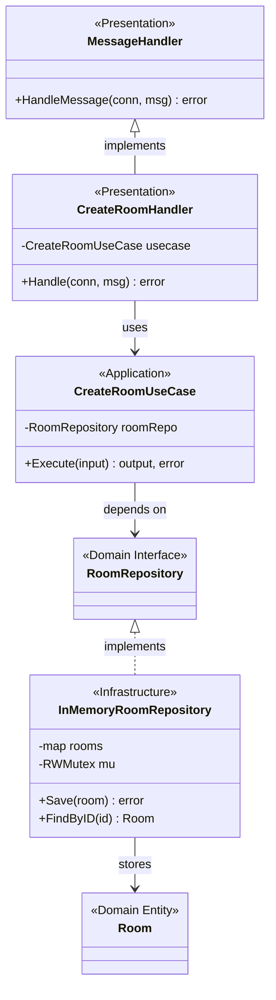

---

## 5. シーケンス図

### 5.1 ルーム作成フロー

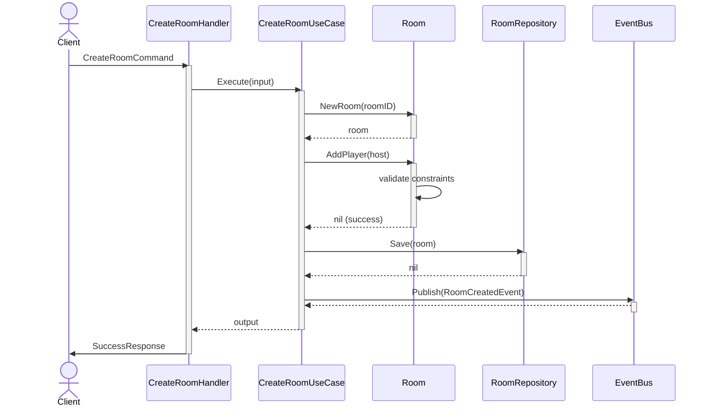

### 5.2 ゲーム開始フロー

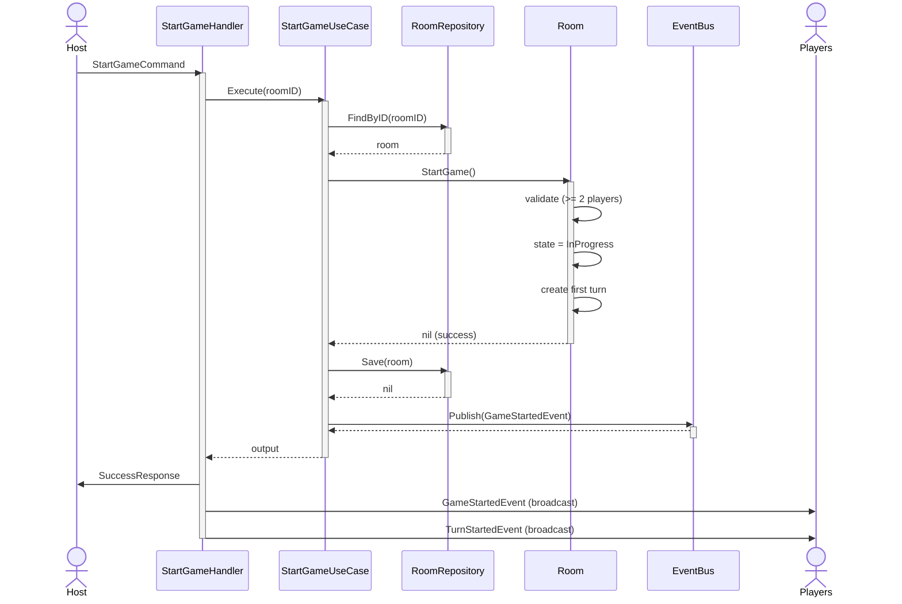

### 5.3 ダイスロールフロー

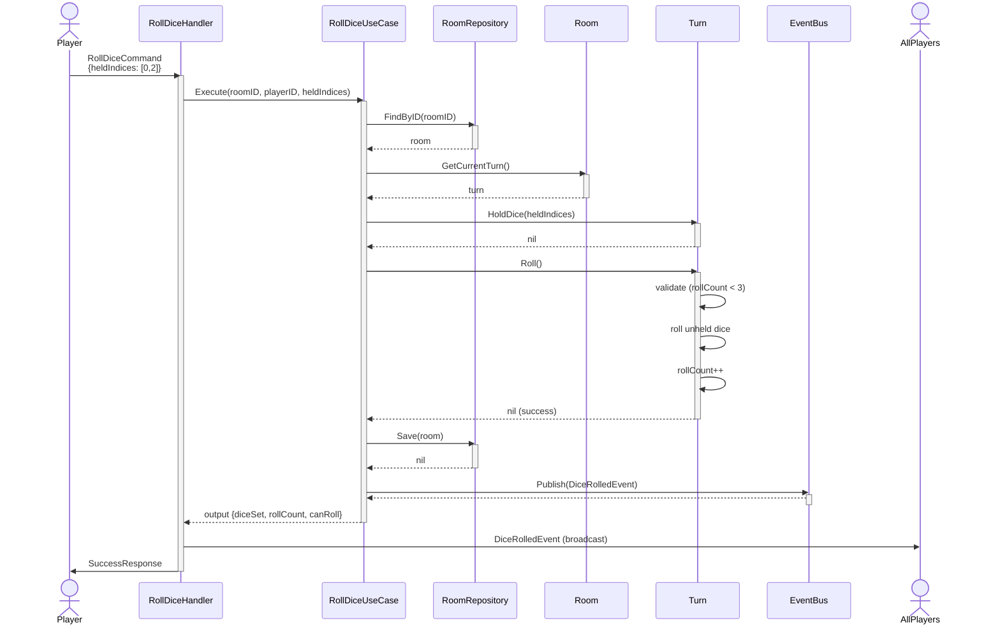

### 5.4 カテゴリー選択・スコア記録フロー

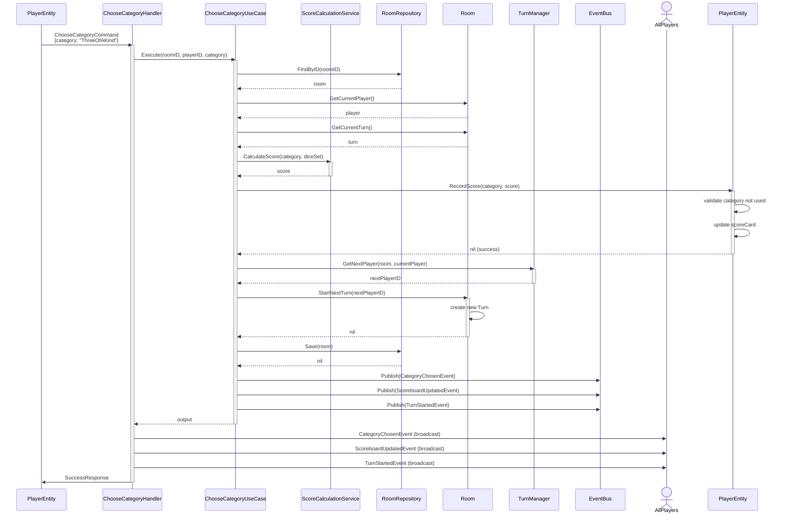

### 5.5 ゲーム終了フロー

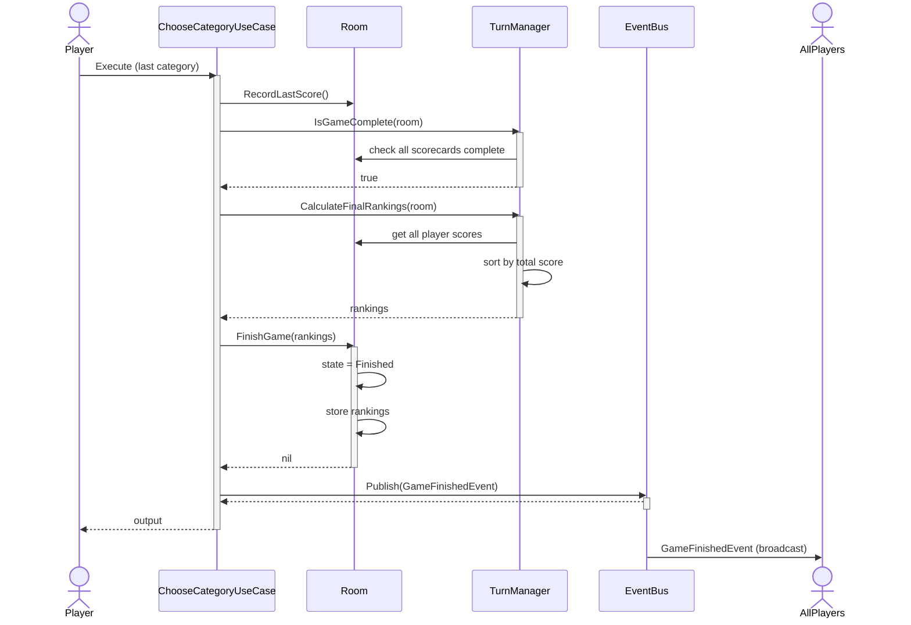

---

## 6. 状態遷移図

### 6.1 Room State Transitions

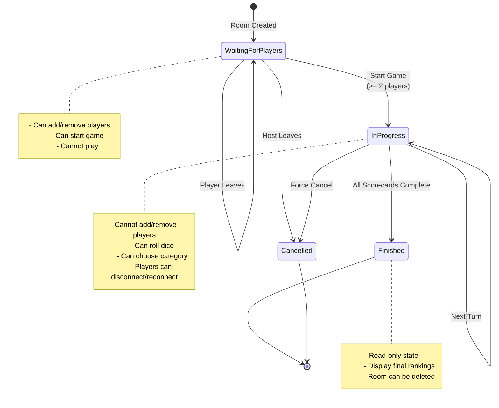

### 6.2 Turn Phase Transitions

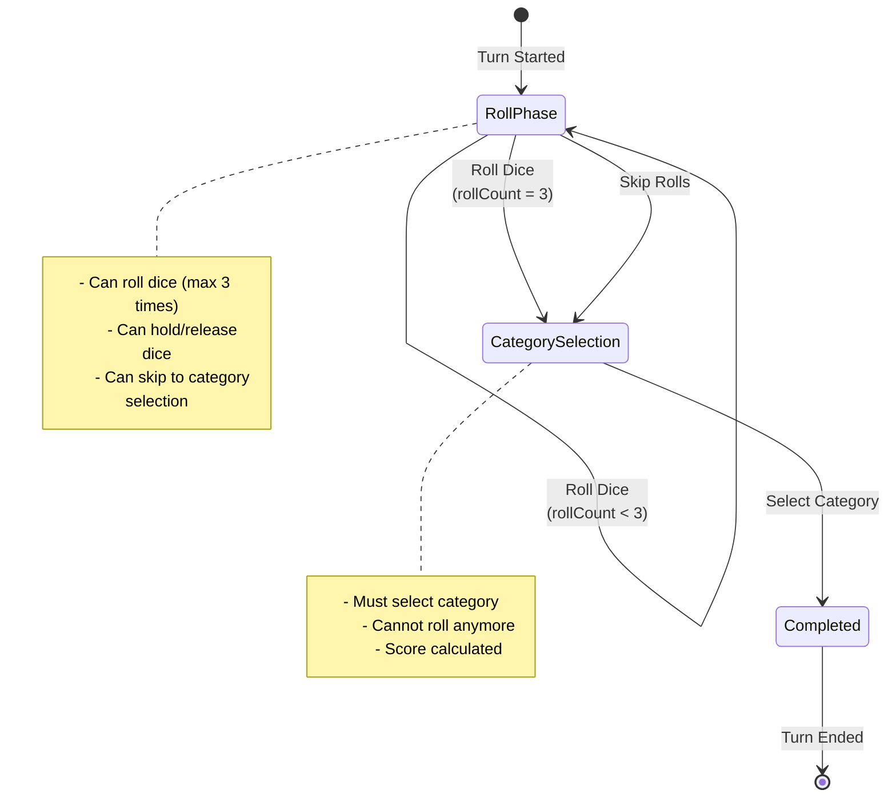

### 6.3 Player State Transitions

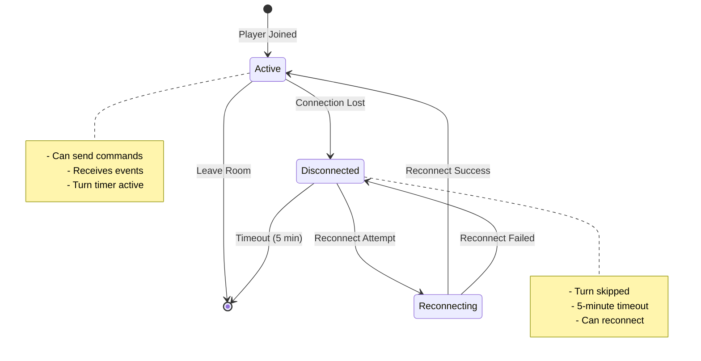

---

## 7. コンポーネント図

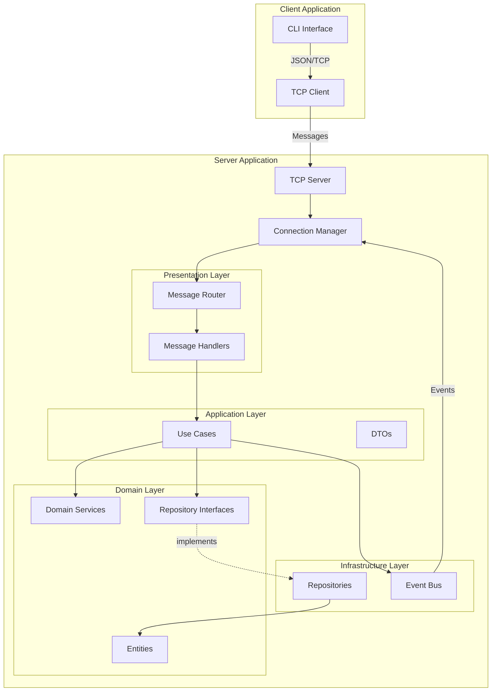

---

## 8. データフロー図

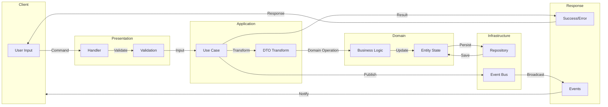

---

## まとめ

これらの図により：

✅ **視覚的理解**: システムの構造と振る舞いを直感的に把握
✅ **関係性の明確化**: クラス間、レイヤー間の関係が明確
✅ **フローの追跡**: リクエストの流れを時系列で追跡可能
✅ **状態管理の可視化**: 状態遷移のルールが明確
✅ **コミュニケーション**: チーム内での設計議論に活用可能

次のステップ: テスタビリティ設計書で、テスト戦略とモック設計を定義します。
