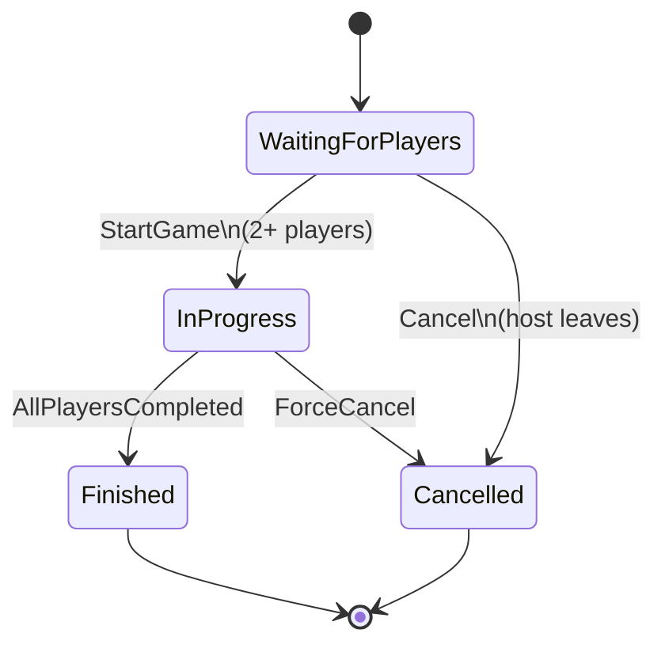
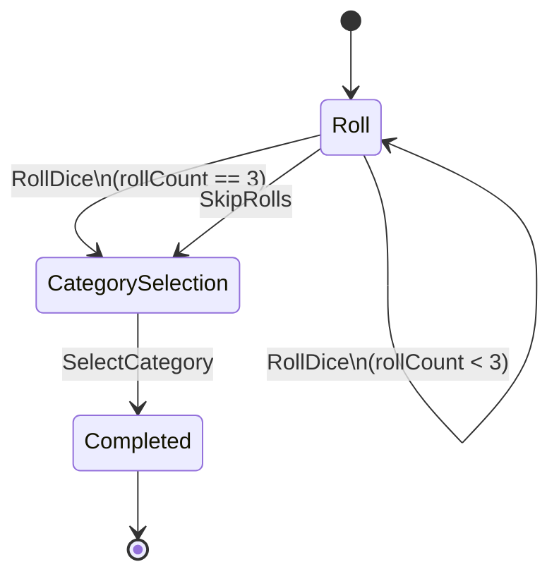
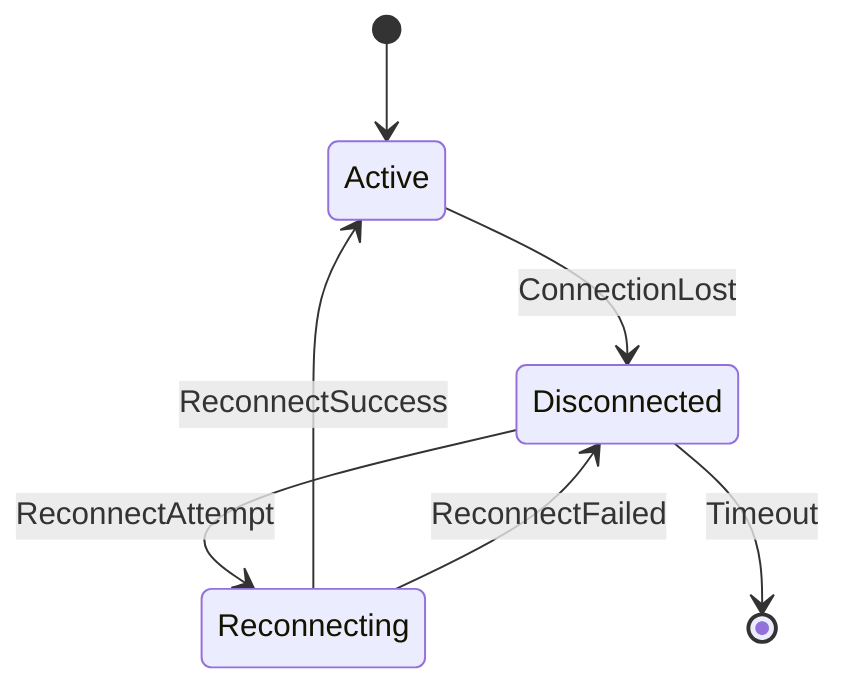

# 状態管理設計書

## 概要

本ドキュメントはYatzCLIのゲーム状態管理設計を定義します。有限状態機械（FSM）パターンとState Patternを使用し、状態遷移の明確化と一貫性を保証します。

## 設計原則

### 1. 明示的な状態遷移

- すべての状態遷移は明示的に定義
- 不正な状態遷移はコンパイル時または実行時に検出
- 状態遷移にはビジネスルールを適用

### 2. 不変条件の保護

- 各状態で許可される操作を制限
- 状態遷移時に不変条件をチェック
- 集約ルートが状態の一貫性を保証

### 3. イベント駆動

- 状態変化をドメインイベントとして発行
- イベントソーシング的アプローチの採用（オプション）
- イベントログによる監査証跡の確保

---

## ゲーム状態の定義

### 1. Room State（ルーム状態）

```go
package domain

type RoomState int

const (
    RoomStateWaitingForPlayers RoomState = iota
    RoomStateInProgress
    RoomStateFinished
    RoomStateCancelled
)

func (s RoomState) String() string {
    return [...]string{
        "WaitingForPlayers",
        "InProgress",
        "Finished",
        "Cancelled",
    }[s]
}
```

#### 状態遷移図



#### 各状態の詳細

**WaitingForPlayers（プレイヤー待機中）**
- **許可される操作**: プレイヤー参加、プレイヤー退出、ゲーム開始
- **不変条件**: プレイヤー数 >= 1、プレイヤー数 <= MaxPlayers
- **遷移条件**:
  - → InProgress: プレイヤー数 >= 2 かつ StartGame() 呼び出し
  - → Cancelled: ホストが退出

```go
func (r *Room) CanStartGame() bool {
    return r.state == RoomStateWaitingForPlayers &&
           len(r.players) >= 2 &&
           len(r.players) <= r.maxPlayers
}

func (r *Room) StartGame() error {
    if !r.CanStartGame() {
        return ErrCannotStartGame
    }

    r.state = RoomStateInProgress
    r.gameStartedAt = time.Now()
    r.turn = NewTurn(r.getFirstPlayerID())

    // イベント発行
    r.recordEvent(GameStartedEvent{
        RoomID:    r.id,
        PlayerIDs: r.getPlayerIDs(),
        Timestamp: time.Now(),
    })

    return nil
}
```

**InProgress（ゲーム進行中）**
- **許可される操作**: ダイスロール、カテゴリー選択、ターン進行
- **許可されない操作**: プレイヤー参加/退出
- **遷移条件**:
  - → Finished: すべてのプレイヤーがスコアカードを完成
  - → Cancelled: 強制キャンセル（全プレイヤー切断など）

```go
func (r *Room) IsGameComplete() bool {
    if r.state != RoomStateInProgress {
        return false
    }

    for _, player := range r.players {
        if !player.scoreCard.IsComplete() {
            return false
        }
    }
    return true
}

func (r *Room) FinishGame() error {
    if !r.IsGameComplete() {
        return ErrGameNotComplete
    }

    r.state = RoomStateFinished
    r.gameFinishedAt = time.Now()
    r.rankings = r.calculateRankings()

    r.recordEvent(GameFinishedEvent{
        RoomID:    r.id,
        Rankings:  r.rankings,
        Timestamp: time.Now(),
    })

    return nil
}
```

**Finished（ゲーム終了）**
- **許可される操作**: 結果閲覧のみ
- **許可されない操作**: すべてのゲーム操作
- **終了処理**: ルームは一定時間後に削除可能

**Cancelled（キャンセル）**
- **許可される操作**: なし
- **終了処理**: 即座に削除可能

---

### 2. Turn State（ターン状態）

```go
type TurnPhase int

const (
    TurnPhaseRoll TurnPhase = iota
    TurnPhaseCategorySelection
    TurnPhaseCompleted
)
```

#### ターン状態遷移図



#### Turn エンティティの設計

```go
type Turn struct {
    playerID  PlayerID
    diceSet   DiceSet
    rollCount int
    phase     TurnPhase
    startedAt time.Time

    // 状態遷移の記録（イベントソーシング用）
    events []DomainEvent
}

func NewTurn(playerID PlayerID) *Turn {
    return &Turn{
        playerID:  playerID,
        diceSet:   NewDiceSet(),
        rollCount: 0,
        phase:     TurnPhaseRoll,
        startedAt: time.Now(),
        events:    make([]DomainEvent, 0),
    }
}
```

#### ロールフェーズ

```go
func (t *Turn) CanRoll() bool {
    return t.phase == TurnPhaseRoll && t.rollCount < MaxRollsPerTurn
}

func (t *Turn) Roll() error {
    if !t.CanRoll() {
        if t.rollCount >= MaxRollsPerTurn {
            return ErrMaxRollsExceeded
        }
        return ErrInvalidTurnPhase
    }

    t.diceSet = t.diceSet.RollUnheld()
    t.rollCount++

    // ロール回数上限に達したらフェーズ遷移
    if t.rollCount >= MaxRollsPerTurn {
        t.transitionToCategorySelection()
    }

    t.recordEvent(DiceRolledEvent{
        PlayerID:  t.playerID,
        DiceSet:   t.diceSet,
        RollCount: t.rollCount,
        Timestamp: time.Now(),
    })

    return nil
}

func (t *Turn) HoldDice(indices []int) error {
    if t.phase != TurnPhaseRoll {
        return ErrInvalidTurnPhase
    }

    newDiceSet, err := t.diceSet.HoldDice(indices)
    if err != nil {
        return err
    }

    t.diceSet = newDiceSet
    return nil
}

func (t *Turn) SkipRolls() error {
    if t.phase != TurnPhaseRoll {
        return ErrInvalidTurnPhase
    }

    t.transitionToCategorySelection()
    return nil
}

func (t *Turn) transitionToCategorySelection() {
    t.phase = TurnPhaseCategorySelection
    t.recordEvent(TurnPhaseChangedEvent{
        PlayerID: t.playerID,
        NewPhase: TurnPhaseCategorySelection,
    })
}
```

#### カテゴリー選択フェーズ

```go
func (t *Turn) CanSelectCategory() bool {
    return t.phase == TurnPhaseCategorySelection
}

func (t *Turn) SelectCategory(category ScoreCategory, score Score) error {
    if !t.CanSelectCategory() {
        return ErrInvalidTurnPhase
    }

    t.phase = TurnPhaseCompleted

    t.recordEvent(CategorySelectedEvent{
        PlayerID:  t.playerID,
        Category:  category,
        Score:     score,
        DiceSet:   t.diceSet,
        Timestamp: time.Now(),
    })

    return nil
}
```

---

### 3. Player State（プレイヤー状態）

```go
type PlayerState int

const (
    PlayerStateActive PlayerState = iota
    PlayerStateDisconnected
    PlayerStateReconnecting
)
```

#### プレイヤー状態遷移



```go
type Player struct {
    id              PlayerID
    name            PlayerName
    scoreCard       *ScoreCard
    connectionID    ConnectionID
    state           PlayerState
    lastSeenAt      time.Time
    disconnectedAt  *time.Time
}

func (p *Player) Disconnect() {
    p.state = PlayerStateDisconnected
    now := time.Now()
    p.disconnectedAt = &now
}

func (p *Player) Reconnect(newConnectionID ConnectionID) error {
    if p.state != PlayerStateDisconnected && p.state != PlayerStateReconnecting {
        return ErrInvalidPlayerState
    }

    p.state = PlayerStateActive
    p.connectionID = newConnectionID
    p.lastSeenAt = time.Now()
    p.disconnectedAt = nil

    return nil
}

func (p *Player) IsTimedOut() bool {
    if p.disconnectedAt == nil {
        return false
    }
    return time.Since(*p.disconnectedAt) > PlayerDisconnectTimeout
}
```

---

## State Patternの適用

### RoomState インターフェース

```go
type RoomStateHandler interface {
    CanAddPlayer(room *Room) bool
    CanRemovePlayer(room *Room) bool
    CanStartGame(room *Room) bool
    CanRollDice(room *Room) bool
    CanSelectCategory(room *Room) bool

    OnEnter(room *Room)
    OnExit(room *Room)
}
```

### 各状態の実装

```go
// WaitingForPlayers状態
type WaitingForPlayersState struct{}

func (s *WaitingForPlayersState) CanAddPlayer(room *Room) bool {
    return len(room.players) < room.maxPlayers
}

func (s *WaitingForPlayersState) CanRemovePlayer(room *Room) bool {
    return true
}

func (s *WaitingForPlayersState) CanStartGame(room *Room) bool {
    return len(room.players) >= 2
}

func (s *WaitingForPlayersState) CanRollDice(room *Room) bool {
    return false
}

func (s *WaitingForPlayersState) CanSelectCategory(room *Room) bool {
    return false
}

// InProgress状態
type InProgressState struct{}

func (s *InProgressState) CanAddPlayer(room *Room) bool {
    return false // ゲーム中は参加不可
}

func (s *InProgressState) CanRemovePlayer(room *Room) bool {
    return false // ゲーム中は退出不可（切断のみ）
}

func (s *InProgressState) CanStartGame(room *Room) bool {
    return false
}

func (s *InProgressState) CanRollDice(room *Room) bool {
    return room.turn != nil && room.turn.CanRoll()
}

func (s *InProgressState) CanSelectCategory(room *Room) bool {
    return room.turn != nil && room.turn.CanSelectCategory()
}
```

### Room での利用

```go
type Room struct {
    // ...
    state        RoomState
    stateHandler RoomStateHandler
}

var stateHandlers = map[RoomState]RoomStateHandler{
    RoomStateWaitingForPlayers: &WaitingForPlayersState{},
    RoomStateInProgress:        &InProgressState{},
    RoomStateFinished:          &FinishedState{},
    RoomStateCancelled:         &CancelledState{},
}

func (r *Room) transitionTo(newState RoomState) error {
    if !r.canTransitionTo(newState) {
        return ErrInvalidStateTransition
    }

    oldState := r.state
    oldHandler := r.stateHandler

    r.state = newState
    r.stateHandler = stateHandlers[newState]

    // 状態遷移イベント
    if oldHandler != nil {
        oldHandler.OnExit(r)
    }
    r.stateHandler.OnEnter(r)

    r.recordEvent(RoomStateChangedEvent{
        RoomID:   r.id,
        OldState: oldState,
        NewState: newState,
        Timestamp: time.Now(),
    })

    return nil
}

func (r *Room) AddPlayer(player *Player) error {
    if !r.stateHandler.CanAddPlayer(r) {
        return ErrOperationNotAllowed
    }

    // プレイヤー追加処理
    r.players[player.id] = player
    return nil
}
```

---

## 並行性制御（Concurrency Control）

### 1. 粒度レベル

#### 集約レベルのロック（推奨）

```go
type Room struct {
    mu sync.RWMutex // Room集約全体を保護
    // ...
}

func (r *Room) AddPlayer(player *Player) error {
    r.mu.Lock()
    defer r.mu.Unlock()

    // クリティカルセクション
    if !r.stateHandler.CanAddPlayer(r) {
        return ErrOperationNotAllowed
    }
    r.players[player.id] = player
    return nil
}

func (r *Room) GetState() RoomState {
    r.mu.RLock()
    defer r.mu.RUnlock()

    return r.state
}
```

#### RoomManager レベルのロック

```go
type RoomManager struct {
    rooms map[RoomID]*Room
    mu    sync.RWMutex
}

func (rm *RoomManager) GetRoom(id RoomID) (*Room, error) {
    rm.mu.RLock()
    defer rm.mu.RUnlock()

    room, exists := rm.rooms[id]
    if !exists {
        return nil, ErrRoomNotFound
    }
    return room, nil
}

func (rm *RoomManager) CreateRoom(room *Room) error {
    rm.mu.Lock()
    defer rm.mu.Unlock()

    if _, exists := rm.rooms[room.id]; exists {
        return ErrRoomAlreadyExists
    }
    rm.rooms[room.id] = room
    return nil
}
```

### 2. デッドロックの回避

#### ロック順序の統一

```go
// ルール: 常に RoomManager → Room の順でロック
func (uc *JoinRoomUseCase) Execute(input JoinRoomInput) error {
    // 1. RoomManagerからRoom取得（RoomManagerがロック）
    room, err := uc.roomManager.GetRoom(input.RoomID)
    if err != nil {
        return err
    }

    // 2. Roomの操作（Roomがロック）
    if err := room.AddPlayer(player); err != nil {
        return err
    }

    return nil
}
```

#### タイムアウト付きロック

```go
type Room struct {
    mu      sync.RWMutex
    timeout time.Duration
}

func (r *Room) tryLock(timeout time.Duration) bool {
    done := make(chan struct{})
    go func() {
        r.mu.Lock()
        close(done)
    }()

    select {
    case <-done:
        return true
    case <-time.After(timeout):
        return false
    }
}
```

### 3. チャネルベースの同期（代替案）

```go
type Room struct {
    commandCh chan RoomCommand
    queryCh   chan RoomQuery
    // ...
}

type RoomCommand interface {
    Execute(room *Room) error
}

type AddPlayerCommand struct {
    Player   *Player
    ResultCh chan error
}

func (r *Room) Run() {
    for {
        select {
        case cmd := <-r.commandCh:
            result := cmd.Execute(r)
            if resultCmd, ok := cmd.(interface{ SendResult(error) }); ok {
                resultCmd.SendResult(result)
            }
        case query := <-r.queryCh:
            result := query.Execute(r)
            query.SendResult(result)
        }
    }
}

// 使用例
func (rm *RoomManager) AddPlayerToRoom(roomID RoomID, player *Player) error {
    room := rm.rooms[roomID]
    resultCh := make(chan error)

    room.commandCh <- AddPlayerCommand{
        Player:   player,
        ResultCh: resultCh,
    }

    return <-resultCh
}
```

---

## イベントソーシング的アプローチ

### イベントストアの設計

```go
type DomainEvent interface {
    EventID() string
    AggregateID() string
    OccurredAt() time.Time
    EventType() string
}

type EventStore interface {
    Append(event DomainEvent) error
    GetEvents(aggregateID string) ([]DomainEvent, error)
    GetEventsSince(aggregateID string, timestamp time.Time) ([]DomainEvent, error)
}

type EventSourcedRoom struct {
    id      RoomID
    version int
    events  []DomainEvent

    // 現在の状態（イベントから再構築）
    players       map[PlayerID]*Player
    state         RoomState
    turn          *Turn
}

func (r *EventSourcedRoom) recordEvent(event DomainEvent) {
    r.events = append(r.events, event)
    r.version++
    r.apply(event) // イベントを適用して状態を更新
}

func (r *EventSourcedRoom) apply(event DomainEvent) {
    switch e := event.(type) {
    case GameStartedEvent:
        r.state = RoomStateInProgress
        r.turn = NewTurn(r.getFirstPlayerID())

    case DiceRolledEvent:
        r.turn.diceSet = e.DiceSet
        r.turn.rollCount = e.RollCount

    case CategorySelectedEvent:
        player := r.players[e.PlayerID]
        player.scoreCard.RecordScore(e.Category, e.Score)
        // 次のプレイヤーへ
        r.advanceTurn()

    case GameFinishedEvent:
        r.state = RoomStateFinished
    }
}

// イベントから状態を再構築
func ReconstructRoom(events []DomainEvent) *EventSourcedRoom {
    room := &EventSourcedRoom{
        players: make(map[PlayerID]*Player),
    }

    for _, event := range events {
        room.apply(event)
    }

    return room
}
```

### スナップショットによる最適化

```go
type Snapshot struct {
    AggregateID string
    Version     int
    State       interface{}
    Timestamp   time.Time
}

type SnapshotStore interface {
    SaveSnapshot(snapshot Snapshot) error
    GetLatestSnapshot(aggregateID string) (*Snapshot, error)
}

func ReconstructRoomWithSnapshot(
    snapshotStore SnapshotStore,
    eventStore EventStore,
    roomID RoomID,
) (*EventSourcedRoom, error) {
    // 最新のスナップショットを取得
    snapshot, err := snapshotStore.GetLatestSnapshot(string(roomID))
    if err != nil {
        return nil, err
    }

    room := snapshot.State.(*EventSourcedRoom)

    // スナップショット以降のイベントを適用
    events, err := eventStore.GetEventsSince(string(roomID), snapshot.Timestamp)
    if err != nil {
        return nil, err
    }

    for _, event := range events {
        room.apply(event)
    }

    return room, nil
}
```

---

## トランザクション管理

### ユニット・オブ・ワーク（Unit of Work）パターン

```go
type UnitOfWork interface {
    RegisterNew(entity Entity)
    RegisterDirty(entity Entity)
    RegisterDeleted(entity Entity)
    Commit() error
    Rollback() error
}

type unitOfWork struct {
    newEntities     []Entity
    dirtyEntities   []Entity
    deletedEntities []Entity
    repositories    map[string]Repository
}

func (uow *unitOfWork) Commit() error {
    // トランザクション開始
    tx, err := uow.beginTransaction()
    if err != nil {
        return err
    }
    defer tx.Rollback() // エラー時は自動ロールバック

    // 新規エンティティの保存
    for _, entity := range uow.newEntities {
        if err := uow.insert(tx, entity); err != nil {
            return err
        }
    }

    // 変更されたエンティティの更新
    for _, entity := range uow.dirtyEntities {
        if err := uow.update(tx, entity); err != nil {
            return err
        }
    }

    // 削除されたエンティティの削除
    for _, entity := range uow.deletedEntities {
        if err := uow.delete(tx, entity); err != nil {
            return err
        }
    }

    // コミット
    return tx.Commit()
}
```

### 楽観的ロック（Optimistic Locking）

```go
type Room struct {
    id      RoomID
    version int // バージョン番号
    // ...
}

func (repo *RoomRepository) Save(room *Room) error {
    query := `
        UPDATE rooms
        SET state = ?, version = version + 1, updated_at = NOW()
        WHERE id = ? AND version = ?
    `

    result, err := repo.db.Exec(query, room.state, room.id, room.version)
    if err != nil {
        return err
    }

    affected, _ := result.RowsAffected()
    if affected == 0 {
        return ErrOptimisticLockFailed // 他のトランザクションが先に更新
    }

    room.version++
    return nil
}
```

---

## まとめ

この状態管理設計により：

✅ **明確な状態遷移**: FSMによる予測可能な動作
✅ **不変条件の保護**: State Patternによる操作制限
✅ **並行性安全**: 適切なロック粒度と戦略
✅ **監査証跡**: イベントソーシングによる完全な履歴
✅ **テスタビリティ**: 状態ハンドラーの独立テスト
✅ **デッドロック回避**: ロック順序の統一とタイムアウト

次のステップ: メッセージプロトコル設計書でJSONベースの通信仕様を定義します。
